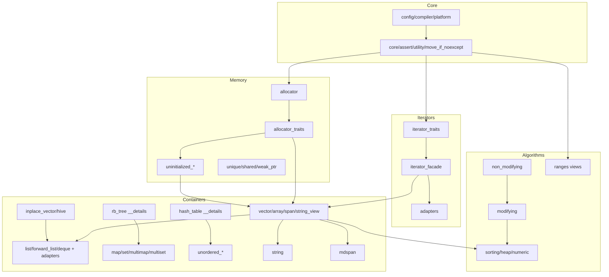

# MySTL 开发计划与路线图（详细版）

## 1. 目标与范围
- 容器：vector、deque、array、list、forward_list、inplace_vector(C++26)、hive(C++26)、map/multimap/set/multiset、unordered_*
- 算法：非修改、修改、排序、堆、数值，含常用 ranges 子集
- 迭代器：concepts、traits、facade、适配器
- memory：allocator、allocator_traits、uninitialized_*、智能指针（unique/shared/weak）
- 字符串：string、string_view，视图：span、mdspan(C++23)
- 三编译器支持：GCC/Clang/MSVC 全流程绿灯

## 2. 里程碑与时间轴（9 周）

```text
周次  任务块                                 关键交付/检查点
W1    基建硬化与基线                         CMake 预设、CI 草案、README 开发者指南
W2    迭代器+内存基础                         iterator_traits/facade，uninitialized_*，unique_ptr
W3    顺序容器(1)：vector + span/sv          vector 核心语义，span/string_view 最小可用
W4    顺序容器(2)：list/flist/deque/适配器   链式/分段容器与 stack/queue/priority_queue
W5    有序关联：红黑树 + map/set 系列         插入/删除/迭代有序性，属性测试对齐 std
W6    无序关联：哈希表 + unordered_* 系列     装载因子/rehash，冲突场景属性/模糊测试
W7    字符串 + ranges 视图子集                string(SBO)，views 组合与惰性
W8    C++26 与 mdspan                         inplace_vector、hive、mdspan 雏形
W9    收尾：文档、基准、稳健性                文档全量、基准对比、fuzz 扩展、三编译器全绿
```

## 3. 依赖关系与实现顺序（模块依赖图）



> 说明：优先保证 Core/Memory/Iterators 基线，随后推进核心容器与算法；`string` 复用 `vector<char>` 设施；`rb_tree/hash_table` 供关联容器使用。

## 4. 阶段任务与验收细则

### W1 基建硬化与基线
- 任务：构建预设（Debug/Release/RelWithDebInfo）、CI 脚本草案（编译+测试+ASan/UBSan）、README 开发者指南（构建/测试/贡献规范）。
- 验收：三编译器本地构建通过；tests/prop/bench 可运行；禁止 `../` 头包含；include guards 统一。

### W2 迭代器与内存基础
- 任务：`iterator_traits`、`facade`、`reverse/move_iterator`；`allocator/allocator_traits/uninitialized_*`；`unique_ptr` 最小可用，`shared/weak` 控制块草案。
- 验收：uninitialized 的异常路径泄漏为 0（ASan/UBSan）；`unique_ptr` 语义与 std 对齐属性测试。

### W3 顺序容器(1)：vector + span/string_view
- 任务：`vector` 的构造/移动/增删/容量/迭代器失效规则；`span/string_view` 基本接口；`copy/move/fill/transform`。
- 验收：`vector` 行为与 `std::vector` 对齐（属性测试+边界单测）；失效规则文档化。

### W4 顺序容器(2)：list/forward_list/deque + 适配器
- 任务：节点/splice/erase 异常安全；`deque` 分段缓冲；`stack/queue/priority_queue`。
- 验收：稳定迭代器/引用；复杂修改操作强/基本保证明确且测试覆盖。

### W5 有序关联：红黑树 + map/set 系列
- 任务：旋转/插入/删除再平衡；lower/upper_bound；透明比较兼容。
- 验收：长时随机插删属性测试绿；中序迭代严格有序；复杂度外观符合预期。

### W6 无序关联：哈希表 + unordered_* 系列
- 任务：链式哈希、装载因子与 rehash 策略；多值容器；迭代器/引用失效规则。
- 验收：冲突场景性质测试；rehash 前后行为与文档一致。

### W7 字符串与 ranges 子集
- 任务：`string` SBO、拼接/查找子集；`views`：take/drop/filter/transform；ranges 算法若干。
- 验收：SBO 边界与异常路径覆盖；视图组合保持惰性且可组合。

### W8 C++26 与 mdspan
- 任务：`inplace_vector` 固定容量；`hive` 稳定引用/O(1) 删除；`mdspan` 布局策略雏形。
- 验收：容量边界/索引正确性；性能基线观测记录。

## 5. 资源与责任矩阵（RACI 简表）

```text
模块            R(负责)   A(签核)   C(协作)     I(知会)
构建/CI         Dev       Owner     -          All
迭代器/内存     Dev       Owner     Reviewer   All
顺序容器        Dev       Owner     Reviewer   All
关联容器        Dev       Owner     Reviewer   All
无序容器        Dev       Owner     Reviewer   All
字符串/ranges   Dev       Owner     Reviewer   All
算法            Dev       Owner     Reviewer   All
文档/发布       Dev       Owner     -          All
```

## 6. 风险与缓解（风险矩阵）

```text
风险                             概率  影响  等级  缓解
红黑树/哈希实现复杂度高          中    高    高    先桩后实、属性测试覆盖、分步上线
异常安全强保证难度               中    中    中    先基本保证、逐步升级、文档标注
三编译器差异与告警               中    中    中    设定编译宏/开关、保持 Werror 可配
mdspan/hive 规范变化             低    中    中    标注试验性、接口稳定前内部迭代
过早优化影响可维护性             高    中    高    基准仅观察、不以基准驱动设计
```

## 9. 进度追踪

```mermaid
gantt
  title MySTL 
  dateFormat  WW
  axisFormat  %W
  section 基建
  基建硬化          :done, 01, 1w
  section 基础
  迭代器与内存      :active, 02, 1w
  顺序容器(1)       : 03, 1w
  顺序容器(2)       : 04, 1w
  section 关联
  红黑树+有序关联   : 05, 1w
  哈希+无序关联     : 06, 1w
  section 高级
  字符串+ranges     : 07, 1w
  C++26与mdspan     : 08, 1w
  section 收尾
  文档基准发布      : 09, 1w
```


