```mermaid
graph TB
    %% ========== 基础设施层 ==========
    subgraph Infrastructure["🔧 基础设施层 (Week 1-2)"]
        CONFIG["config.hpp<br/>编译器特性检测"]
        VERSION["version.hpp<br/>版本管理"]
        PRELUDE["prelude.hpp<br/>通用宏"]
        TEST["test/<br/>测试框架"]
    end

    %% ========== Core 模块 ==========
    subgraph Core["💎 Core 模块 (Week 3-5)"]
        direction TB
        META["__detail/meta.hpp<br/>index_sequence, void_t"]
        CONCEPTS_BASE["__detail/concepts_base.hpp<br/>same_as, derived_from"]
        TRAITS["type_traits.hpp<br/>80+ traits"]
        CONCEPTS["concepts.hpp<br/>核心 concepts"]
        UTILITY["utility.hpp<br/>move, forward"]
        PAIR["pair.hpp"]
        TUPLE["tuple.hpp"]
        COMPARE["compare.hpp<br/>三路比较"]
        INVOKE["__detail/invoke.hpp<br/>通用调用"]
        INIT_LIST["initializer_list.hpp"]
        LIMITS["limits.hpp"]
    end

    %% ========== Memory 模块 ==========
    subgraph Memory["🧠 Memory 模块 (Week 6-7)"]
        direction TB
        ALLOC_BASE["__detail/allocator_base.hpp"]
        ALLOCATOR["allocator.hpp"]
        ALLOC_TRAITS["allocator_traits.hpp"]
        PTR_TRAITS["pointer_traits.hpp"]
        CONSTRUCT["construct.hpp"]
        DESTROY["destroy.hpp"]
        UNINIT["uninitialized.hpp"]
        REF_COUNT["__detail/ref_count.hpp<br/>引用计数"]
        UNIQUE_PTR["unique_ptr.hpp"]
        SHARED_PTR["shared_ptr.hpp"]
        WEAK_PTR["weak_ptr.hpp"]
        ENABLE_SHARED["enable_shared_from_this.hpp"]
        MEM_RESOURCE["memory_resource.hpp"]
    end

    %% ========== Iterator 模块 ==========
    subgraph Iterator["🔄 Iterator 模块 (Week 8)"]
        direction TB
        ITER_TAGS["__detail/iterator_tags.hpp<br/>5种类别"]
        ITER_TRAITS["iterator_traits.hpp"]
        ITER_CONCEPTS["iterator_concepts.hpp"]
        ITER_BASE["iterator_base.hpp"]
        REVERSE_ITER["reverse_iterator.hpp"]
        MOVE_ITER["move_iterator.hpp"]
        INSERT_ITER["insert_iterator.hpp"]
        ADVANCE["advance.hpp"]
        DISTANCE["distance.hpp"]
    end

    %% ========== Container 模块 ==========
    subgraph Container["📦 Container 模块 (Week 9-12)"]
        direction TB
        
        subgraph Sequential["顺序容器"]
            VEC_BASE["__detail/vector_base.hpp"]
            VECTOR["vector.hpp"]
            ARRAY["array.hpp"]
            LIST_NODE["__detail/list_node.hpp"]
            LIST["list.hpp"]
            DEQUE["deque.hpp"]
            FWD_LIST["forward_list.hpp"]
        end
        
        subgraph Associative["关联容器"]
            RB_TREE["__detail/rb_tree.hpp<br/>红黑树"]
            SET["set.hpp"]
            MAP["map.hpp"]
            MULTISET["multiset.hpp"]
            MULTIMAP["multimap.hpp"]
        end
        
        subgraph Unordered["无序容器"]
            HASH["hash.hpp<br/>FNV-1a"]
            HASHTABLE["__detail/hashtable.hpp"]
            UNORD_SET["unordered_set.hpp"]
            UNORD_MAP["unordered_map.hpp"]
            UNORD_MULTISET["unordered_multiset.hpp"]
            UNORD_MULTIMAP["unordered_multimap.hpp"]
        end
        
        subgraph Adaptors["容器适配器"]
            STACK["stack.hpp"]
            QUEUE["queue.hpp"]
            PRIORITY_QUEUE["priority_queue.hpp"]
        end
    end

    %% ========== Algorithm 模块 ==========
    subgraph Algorithm["⚙️ Algorithm 模块 (Week 13-14)"]
        direction TB
        ALG_BASE["__detail/alg_base.hpp<br/>调度器"]
        HEAP_IMPL["__detail/heap_impl.hpp"]
        SORT_IMPL["__detail/sort_impl.hpp<br/>introsort"]
        
        FIND["find.hpp / count.hpp"]
        COPY["copy.hpp / fill.hpp"]
        FOR_EACH["for_each.hpp"]
        TRANSFORM_ALG["transform.hpp"]
        
        HEAP["heap.hpp"]
        SORT["sort.hpp"]
        MERGE["merge.hpp"]
        PARTITION["partition.hpp"]
        BINARY_SEARCH["binary_search.hpp"]
        SET_OPS["set_operations.hpp"]
        MINMAX["minmax.hpp"]
    end

    %% ========== Ranges 模块 ==========
    subgraph Ranges["🔗 Ranges 模块 (Week 15-16)"]
        direction TB
        RANGE_TRAITS["__detail/range_traits.hpp"]
        VIEW_INTERFACE["__detail/view_interface.hpp<br/>CRTP基类"]
        RANGE_CONCEPTS["range_concepts.hpp"]
        VIEW["view.hpp"]
        SUBRANGE["subrange.hpp"]
        
        IOTA_VIEW["iota_view.hpp"]
        FILTER_VIEW["filter_view.hpp"]
        TRANSFORM_VIEW["transform_view.hpp"]
        TAKE_VIEW["take_view.hpp"]
        JOIN_VIEW["join_view.hpp"]
        ADAPTOR_CLOSURE["range_adaptor_closure.hpp<br/>管道操作符"]
        RANGES_ALG["ranges_algorithm.hpp"]
    end

    %% ========== Utility 模块 ==========
    subgraph Utility["🛠️ Utility 模块 (Week 17-18)"]
        direction TB
        OPT_BASE["__detail/optional_base.hpp"]
        OPTIONAL["optional.hpp<br/>monadic操作"]
        
        VAR_STORAGE["__detail/variant_storage.hpp"]
        VARIANT["variant.hpp<br/>visit支持"]
        
        EXP_BASE["__detail/expected_base.hpp"]
        EXPECTED["expected.hpp<br/>错误处理"]
        
        STRING_VIEW["string_view.hpp"]
        STRING["string.hpp<br/>SSO优化"]
        SPAN["span.hpp"]
        ANY["any.hpp<br/>类型擦除"]
        BITSET["bitset.hpp"]
        RATIO["ratio.hpp"]
        CHRONO["chrono.hpp"]
        FORMAT["format.hpp"]
    end

    %% ========== Threading 模块 ==========
    subgraph Threading["🧵 Threading 模块 (Week 19)"]
        direction TB
        THREAD_BASE["__detail/thread_base.hpp<br/>平台适配"]
        ATOMIC_IMPL["__detail/atomic_impl.hpp"]
        
        THREAD["thread.hpp"]
        MUTEX["mutex.hpp"]
        LOCK_GUARD["lock_guard.hpp"]
        ATOMIC["atomic.hpp"]
        CONDITION_VAR["condition_variable.hpp"]
        FUTURE["future.hpp"]
        PROMISE["promise.hpp"]
    end

    %% ========== 聚合层 ==========
    STL_HPP["🎯 stl.hpp<br/>单头聚合"]

    %% ========== 依赖关系 ==========
    
    %% 基础设施 → Core
    CONFIG --> META
    CONFIG --> CONCEPTS_BASE
    PRELUDE --> META
    
    %% Core 内部依赖
    META --> CONCEPTS_BASE
    META --> TRAITS
    CONCEPTS_BASE --> TRAITS
    TRAITS --> CONCEPTS
    TRAITS --> UTILITY
    UTILITY --> PAIR
    PAIR --> TUPLE
    CONCEPTS --> COMPARE
    UTILITY --> INVOKE
    
    %% Core → Memory
    TRAITS --> ALLOC_BASE
    UTILITY --> ALLOC_BASE
    ALLOC_BASE --> ALLOCATOR
    ALLOCATOR --> ALLOC_TRAITS
    TRAITS --> PTR_TRAITS
    ALLOC_TRAITS --> CONSTRUCT
    ALLOC_TRAITS --> DESTROY
    CONSTRUCT --> UNINIT
    ALLOCATOR --> REF_COUNT
    PTR_TRAITS --> UNIQUE_PTR
    REF_COUNT --> SHARED_PTR
    SHARED_PTR --> WEAK_PTR
    SHARED_PTR --> ENABLE_SHARED
    ALLOC_TRAITS --> MEM_RESOURCE
    
    %% Core → Iterator
    TRAITS --> ITER_TAGS
    ITER_TAGS --> ITER_TRAITS
    CONCEPTS --> ITER_CONCEPTS
    ITER_TRAITS --> ITER_BASE
    ITER_BASE --> REVERSE_ITER
    ITER_BASE --> MOVE_ITER
    ITER_BASE --> INSERT_ITER
    ITER_TRAITS --> ADVANCE
    ITER_TRAITS --> DISTANCE
    
    %% Memory + Iterator → Container
    ALLOC_TRAITS --> VEC_BASE
    VEC_BASE --> VECTOR
    INIT_LIST --> VECTOR
    TRAITS --> ARRAY
    
    ALLOC_TRAITS --> LIST_NODE
    LIST_NODE --> LIST
    ITER_BASE --> LIST
    
    ALLOC_TRAITS --> DEQUE
    ALLOC_TRAITS --> FWD_LIST
    
    ALLOC_TRAITS --> RB_TREE
    ITER_BASE --> RB_TREE
    COMPARE --> RB_TREE
    RB_TREE --> SET
    RB_TREE --> MAP
    RB_TREE --> MULTISET
    RB_TREE --> MULTIMAP
    
    TRAITS --> HASH
    ALLOC_TRAITS --> HASHTABLE
    HASH --> HASHTABLE
    HASHTABLE --> UNORD_SET
    HASHTABLE --> UNORD_MAP
    HASHTABLE --> UNORD_MULTISET
    HASHTABLE --> UNORD_MULTIMAP
    
    DEQUE --> STACK
    DEQUE --> QUEUE
    VECTOR --> PRIORITY_QUEUE
    HEAP --> PRIORITY_QUEUE
    
    %% Iterator → Algorithm
    ITER_TRAITS --> ALG_BASE
    ALG_BASE --> HEAP_IMPL
    ALG_BASE --> SORT_IMPL
    ALG_BASE --> FIND
    ALG_BASE --> COPY
    ALG_BASE --> FOR_EACH
    ALG_BASE --> TRANSFORM_ALG
    
    HEAP_IMPL --> HEAP
    HEAP_IMPL --> SORT_IMPL
    SORT_IMPL --> SORT
    ALG_BASE --> MERGE
    ALG_BASE --> PARTITION
    ALG_BASE --> BINARY_SEARCH
    MERGE --> SET_OPS
    ALG_BASE --> MINMAX
    
    %% Iterator + Concepts → Ranges
    ITER_TRAITS --> RANGE_TRAITS
    CONCEPTS --> RANGE_CONCEPTS
    RANGE_TRAITS --> VIEW_INTERFACE
    VIEW_INTERFACE --> VIEW
    VIEW --> SUBRANGE
    
    VIEW --> IOTA_VIEW
    VIEW --> FILTER_VIEW
    VIEW --> TRANSFORM_VIEW
    VIEW --> TAKE_VIEW
    VIEW --> JOIN_VIEW
    VIEW --> ADAPTOR_CLOSURE
    
    ALG_BASE --> RANGES_ALG
    RANGE_CONCEPTS --> RANGES_ALG
    
    %% Core → Utility
    TRAITS --> OPT_BASE
    OPT_BASE --> OPTIONAL
    
    TRAITS --> VAR_STORAGE
    VAR_STORAGE --> VARIANT
    
    VARIANT --> EXP_BASE
    EXP_BASE --> EXPECTED
    
    ITER_BASE --> STRING_VIEW
    STRING_VIEW --> STRING
    VECTOR --> STRING
    
    ITER_BASE --> SPAN
    
    ALLOC_TRAITS --> ANY
    
    TRAITS --> BITSET
    TRAITS --> RATIO
    RATIO --> CHRONO
    STRING --> FORMAT
    
    %% Core → Threading
    TRAITS --> THREAD_BASE
    THREAD_BASE --> ATOMIC_IMPL
    THREAD_BASE --> THREAD
    THREAD_BASE --> MUTEX
    MUTEX --> LOCK_GUARD
    ATOMIC_IMPL --> ATOMIC
    MUTEX --> CONDITION_VAR
    THREAD --> FUTURE
    THREAD --> PROMISE
    
    %% 所有模块 → 聚合
    Core -.-> STL_HPP
    Memory -.-> STL_HPP
    Iterator -.-> STL_HPP
    Container -.-> STL_HPP
    Algorithm -.-> STL_HPP
    Ranges -.-> STL_HPP
    Utility -.-> STL_HPP
    Threading -.-> STL_HPP
    
    %% 样式定义
    classDef infra fill:#e1f5ff,stroke:#01579b,stroke-width:2px
    classDef core fill:#fff3e0,stroke:#e65100,stroke-width:2px
    classDef memory fill:#f3e5f5,stroke:#4a148c,stroke-width:2px
    classDef iterator fill:#e8f5e9,stroke:#1b5e20,stroke-width:2px
    classDef container fill:#fce4ec,stroke:#880e4f,stroke-width:2px
    classDef algorithm fill:#fff9c4,stroke:#f57f17,stroke-width:2px
    classDef ranges fill:#e0f2f1,stroke:#004d40,stroke-width:2px
    classDef utility fill:#fbe9e7,stroke:#bf360c,stroke-width:2px
    classDef threading fill:#ede7f6,stroke:#311b92,stroke-width:2px
    classDef aggregate fill:#ffebee,stroke:#b71c1c,stroke-width:3px
    
    class CONFIG,VERSION,PRELUDE,TEST infra
    class META,CONCEPTS_BASE,TRAITS,CONCEPTS,UTILITY,PAIR,TUPLE,COMPARE,INVOKE,INIT_LIST,LIMITS core
    class ALLOC_BASE,ALLOCATOR,ALLOC_TRAITS,PTR_TRAITS,CONSTRUCT,DESTROY,UNINIT,REF_COUNT,UNIQUE_PTR,SHARED_PTR,WEAK_PTR,ENABLE_SHARED,MEM_RESOURCE memory
    class ITER_TAGS,ITER_TRAITS,ITER_CONCEPTS,ITER_BASE,REVERSE_ITER,MOVE_ITER,INSERT_ITER,ADVANCE,DISTANCE iterator
    class VEC_BASE,VECTOR,ARRAY,LIST_NODE,LIST,DEQUE,FWD_LIST,RB_TREE,SET,MAP,MULTISET,MULTIMAP,HASH,HASHTABLE,UNORD_SET,UNORD_MAP,UNORD_MULTISET,UNORD_MULTIMAP,STACK,QUEUE,PRIORITY_QUEUE container
    class ALG_BASE,HEAP_IMPL,SORT_IMPL,FIND,COPY,FOR_EACH,TRANSFORM_ALG,HEAP,SORT,MERGE,PARTITION,BINARY_SEARCH,SET_OPS,MINMAX algorithm
    class RANGE_TRAITS,VIEW_INTERFACE,RANGE_CONCEPTS,VIEW,SUBRANGE,IOTA_VIEW,FILTER_VIEW,TRANSFORM_VIEW,TAKE_VIEW,JOIN_VIEW,ADAPTOR_CLOSURE,RANGES_ALG ranges
    class OPT_BASE,OPTIONAL,VAR_STORAGE,VARIANT,EXP_BASE,EXPECTED,STRING_VIEW,STRING,SPAN,ANY,BITSET,RATIO,CHRONO,FORMAT utility
    class THREAD_BASE,ATOMIC_IMPL,THREAD,MUTEX,LOCK_GUARD,ATOMIC,CONDITION_VAR,FUTURE,PROMISE threading
    class STL_HPP aggregate
```

# 手搓 C++23 STL 库开发计划表

基于您提供的完整头文件清单和模块架构，我为您规划了一份分阶段、可追踪的开发计划表。

## 📋 项目概览

**目标**：实现 C++23 兼容的模块化 STL 库  
**开发周期**：约 16-20 周（可根据团队规模调整）  
**核心原则**：自底向上、测试驱动、模块解耦

---

## 🗓️ 开发路线图

### **Phase 0: 基础设施搭建（Week 1-2）**

| 任务 | 优先级 | 预计工时 | 交付物 |
|------|--------|----------|--------|
| 建立项目骨架结构 | P0 | 4h | 完整目录树 + CMakeLists.txt |
| 实现 `config.hpp` / `version.hpp` | P0 | 6h | 编译器特性检测宏、C++23 feature flags |
| 实现 `prelude.hpp` | P0 | 4h | 通用宏、平台适配层 |
| 搭建测试框架 | P0 | 8h | `test_framework.hpp` + `test_macros.hpp` |
| 配置 CI/CD | P1 | 6h | 自动化编译测试（GCC/Clang/MSVC） |

**里程碑**：✅ 可编译空项目 + 基础测试通过

---

### **Phase 1: Core 模块（Week 3-5）**

#### Week 3: 元编程基础
| 文件 | 依赖 | 工时 | 测试重点 |
|------|------|------|----------|
| `__detail/meta.hpp` | 无 | 8h | `index_sequence`, `void_t`, `type_identity` |
| `__detail/concepts_base.hpp` | meta.hpp | 6h | `same_as`, `derived_from`, `convertible_to` |
| `type_traits.hpp` | concepts_base | 12h | 80+ type traits（SFINAE + concepts） |
| `concepts.hpp` | type_traits | 10h | 核心 concepts（`copyable`, `movable`, `regular`） |

#### Week 4: 工具类型
| 文件 | 依赖 | 工时 | 测试重点 |
|------|------|------|----------|
| `utility.hpp` | type_traits | 6h | `forward`, `move`, `declval` |
| `pair.hpp` | utility | 4h | 结构化绑定支持 |
| `tuple.hpp` | pair, meta | 12h | `tuple_cat`, `apply`, `make_from_tuple` |
| `compare.hpp` | concepts | 8h | `<=>` 三路比较实现 |
| `initializer_list.hpp` | 无 | 2h | 编译器内建支持 |

#### Week 5: 完善与测试
| 任务 | 工时 | 验收标准 |
|------|------|----------|
| `limits.hpp` | 4h | 数值类型特性查询 |
| `__detail/invoke.hpp` | 6h | 支持函数对象、成员函数调用 |
| Core 模块集成测试 | 8h | 覆盖率 ≥ 85% |

**里程碑**：✅ Core 模块可独立使用

---

### **Phase 2: Memory 模块（Week 6-7）**

#### Week 6: Allocator 框架
| 文件 | 依赖 | 工时 | 关键点 |
|------|------|------|--------|
| `__detail/allocator_base.hpp` | Core | 6h | 标准 allocator 接口 |
| `allocator.hpp` | allocator_base | 4h | 默认分配器实现 |
| `allocator_traits.hpp` | allocator | 6h | traits 萃取与回退 |
| `pointer_traits.hpp` | type_traits | 4h | fancy pointer 支持 |
| `construct.hpp` / `destroy.hpp` | allocator_traits | 6h | placement new 封装 |

#### Week 7: 智能指针
| 文件 | 依赖 | 工时 | 测试重点 |
|------|------|------|----------|
| `__detail/ref_count.hpp` | allocator | 8h | 原子引用计数 + 控制块 |
| `unique_ptr.hpp` | pointer_traits | 6h | 自定义 deleter 支持 |
| `shared_ptr.hpp` | ref_count | 10h | `make_shared`, aliasing ctor |
| `weak_ptr.hpp` | shared_ptr | 4h | 循环引用检测 |
| `enable_shared_from_this.hpp` | shared_ptr | 4h | CRTP 实现 |
| `uninitialized.hpp` | construct | 6h | 未初始化内存操作 |

**里程碑**：✅ 智能指针可管理自定义类型

---

### **Phase 3: Iterator 模块（Week 8）**

| 文件 | 依赖 | 工时 | 核心功能 |
|------|------|------|----------|
| `__detail/iterator_tags.hpp` | Core | 2h | 5 种迭代器类别 |
| `iterator_traits.hpp` | iterator_tags | 6h | traits 萃取（含 pointer 回退） |
| `iterator_concepts.hpp` | concepts | 6h | `input_iterator`, `forward_iterator` 等 |
| `iterator_base.hpp` | iterator_traits | 4h | 通用迭代器基类 |
| `reverse_iterator.hpp` | iterator_base | 4h | 反向适配器 |
| `move_iterator.hpp` | iterator_base | 3h | 移动语义适配 |
| `insert_iterator.hpp` | iterator_base | 4h | `back_inserter` 等 |
| `advance.hpp` / `distance.hpp` | iterator_traits | 6h | O(1) 优化调度 |

**里程碑**：✅ 迭代器可遍历原生数组 + 自定义容器

---

### **Phase 4: Container 模块（Week 9-12）**

#### Week 9: 顺序容器基础
| 文件 | 依赖 | 工时 | 重点 |
|------|------|------|------|
| `__detail/vector_base.hpp` | Memory | 8h | 内存增长策略（1.5x/2x） |
| `vector.hpp` | vector_base | 10h | 强异常安全保证 |
| `array.hpp` | Core | 4h | 编译期数组 |
| `__detail/list_node.hpp` | Memory | 6h | 双向链表节点 |
| `list.hpp` | list_node | 8h | splice 操作优化 |

#### Week 10: 关联容器
| 文件 | 依赖 | 工时 | 算法 |
|------|------|------|------|
| `__detail/rb_tree.hpp` | Memory, Iterator | 16h | 红黑树实现（含平衡调整） |
| `set.hpp` / `map.hpp` | rb_tree | 8h | 透明比较器支持 |
| `multiset.hpp` / `multimap.hpp` | rb_tree | 4h | equal_range 优化 |

#### Week 11: 无序容器
| 文件 | 依赖 | 工时 | 技术点 |
|------|------|------|--------|
| `hash.hpp` | Core | 6h | FNV-1a / MurmurHash3 |
| `__detail/hashtable.hpp` | Memory, hash | 14h | 开链法 + 动态扩容 |
| `unordered_set.hpp` / `unordered_map.hpp` | hashtable | 6h | 自定义 hasher |
| `unordered_multiset.hpp` / `unordered_multimap.hpp` | hashtable | 4h | 桶内链表管理 |

#### Week 12: 容器适配器 + 完善
| 文件 | 依赖 | 工时 |
|------|------|------|
| `deque.hpp` | Memory | 12h | 分段数组实现 |
| `forward_list.hpp` | Memory | 6h | 单向链表 |
| `stack.hpp` / `queue.hpp` | deque | 4h | 适配器封装 |
| `priority_queue.hpp` | vector | 6h | 堆操作集成 |
| 容器模块集成测试 | | 8h |

**里程碑**：✅ 所有容器通过 Valgrind 内存检测

---

### **Phase 5: Algorithm 模块（Week 13-14）**

#### Week 13: 基础算法
| 文件 | 依赖 | 工时 | 实现 |
|------|------|------|------|
| `__detail/alg_base.hpp` | Iterator | 4h | 迭代器分类调度 |
| `find.hpp` / `count.hpp` | alg_base | 6h | 线性查找优化 |
| `copy.hpp` / `fill.hpp` | alg_base | 6h | memmove 优化 |
| `for_each.hpp` / `transform.hpp` | alg_base | 6h | 并行执行策略（可选） |

#### Week 14: 排序与高级算法
| 文件 | 依赖 | 工时 | 算法 |
|------|------|------|------|
| `__detail/heap_impl.hpp` | alg_base | 6h | push_heap / pop_heap |
| `heap.hpp` | heap_impl | 4h | make_heap / sort_heap |
| `__detail/sort_impl.hpp` | heap_impl | 10h | introsort（快排+堆排+插入排序） |
| `sort.hpp` | sort_impl | 4h | stable_sort（归并排序） |
| `binary_search.hpp` | alg_base | 4h | lower_bound / upper_bound |
| `partition.hpp` | alg_base | 4h | 快速分区 |
| `merge.hpp` | alg_base | 6h | 归并操作 |
| `set_operations.hpp` | merge | 6h | 集合并交差 |
| `minmax.hpp` | alg_base | 4h | 最值查找 |

**里程碑**：✅ 算法性能测试（vs std::算法 ±10%）

---

### **Phase 6: Ranges 模块（Week 15-16）**

#### Week 15: Ranges 基础设施
| 文件 | 依赖 | 工时 | 功能 |
|------|------|------|------|
| `__detail/range_traits.hpp` | Iterator | 6h | begin/end/size 萃取 |
| `range_concepts.hpp` | concepts | 6h | `range`, `sized_range`, `borrowed_range` |
| `__detail/view_interface.hpp` | range_traits | 8h | CRTP view 基类 |
| `view.hpp` / `subrange.hpp` | view_interface | 6h | 基础 view 类型 |

#### Week 16: View Adaptors
| 文件 | 依赖 | 工时 | View 类型 |
|------|------|------|----------|
| `iota_view.hpp` | view | 4h | 序列生成器 |
| `filter_view.hpp` | view | 6h | 谓词过滤 |
| `transform_view.hpp` | view | 6h | 映射转换 |
| `take_view.hpp` | view | 4h | 截取前 N 个元素 |
| `join_view.hpp` | view | 8h | 展平嵌套 range |
| `range_adaptor_closure.hpp` | view | 6h | 管道操作符 `|` |
| `ranges_algorithm.hpp` | Algorithm | 8h | ranges 版算法封装 |

**里程碑**：✅ 支持 `numbers | filter(even) | take(10)` 语法

---

### **Phase 7: Utility 扩展（Week 17-18）**

#### Week 17: 类型安全工具
| 文件 | 依赖 | 工时 | 特性 |
|------|------|------|------|
| `__detail/optional_base.hpp` | Core | 6h | 延迟构造 + trivial 优化 |
| `optional.hpp` | optional_base | 6h | monadic 操作（`and_then`, `transform`） |
| `__detail/variant_storage.hpp` | Core | 10h | 联合体存储 + 索引管理 |
| `variant.hpp` | variant_storage | 8h | `visit` + 异常安全 |
| `__detail/expected_base.hpp` | variant | 8h | success/error 存储 |
| `expected.hpp` | expected_base | 6h | 错误处理 monad |

#### Week 18: 字符串与其他工具
| 文件 | 依赖 | 工时 | 功能 |
|------|------|------|------|
| `string_view.hpp` | Iterator | 6h | 非拥有字符串视图 |
| `string.hpp` | vector, string_view | 12h | SSO（小字符串优化） |
| `span.hpp` | Iterator | 6h | 非拥有连续内存视图 |
| `any.hpp` | Memory | 8h | 类型擦除 + SBO |
| `bitset.hpp` | Core | 6h | 固定大小位集 |
| `chrono.hpp` | ratio | 10h | 时间点与时长 |
| `format.hpp` | string | 12h | C++20 `std::format` 实现 |

**里程碑**：✅ Utility 模块独立可用

---

### **Phase 8: Threading 模块（Week 19，可选）**

| 文件 | 依赖 | 工时 | 平台 |
|------|------|------|------|
| `__detail/thread_base.hpp` | Core | 8h | POSIX/Windows 适配 |
| `thread.hpp` | thread_base | 6h | 线程启动与 join |
| `mutex.hpp` / `lock_guard.hpp` | thread_base | 6h | 基础同步 |
| `atomic.hpp` | Core | 10h | 原子操作 + 内存序 |
| `condition_variable.hpp` | mutex | 6h | 条件变量 |
| `future.hpp` / `promise.hpp` | thread | 8h | 异步任务 |

**里程碑**：✅ 线程安全测试（TSan）

---

### **Phase 9: 集成与优化（Week 20）**

| 任务 | 工时 | 目标 |
|------|------|------|
| 生成单头聚合文件 `stl.hpp` | 4h | 等价 `<bits/stdc++.h>` |
| 性能基准测试 | 8h | 对比 libstdc++/libc++ |
| 内存泄漏检测 | 6h | Valgrind + AddressSanitizer |
| 编写使用文档 | 8h | API 参考 + 示例代码 |
| 代码审查与重构 | 10h | 消除技术债 |

**最终交付**：
- ✅ 完整可用的 C++23 STL 库
- ✅ 95%+ 单元测试覆盖率
- ✅ 性能白皮书（benchmark 报告）
- ✅ 完整文档（含模块依赖图）

---

## 📊 关键里程碑时间线

```
Week 1-2   ████ 基础设施
Week 3-5   ████████ Core 模块
Week 6-7   ████ Memory 模块
Week 8     ██ Iterator 模块
Week 9-12  ████████████ Container 模块
Week 13-14 ████ Algorithm 模块
Week 15-16 ████ Ranges 模块
Week 17-18 ████████ Utility 模块
Week 19    ██ Threading（可选）
Week 20    ████ 集成优化
```

---

